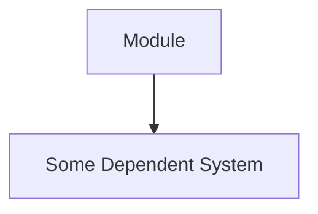
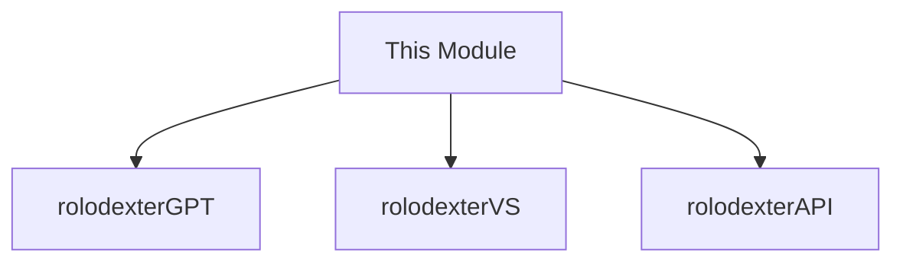

---
# Core Metadata
title: "TITLE OF MODULE"
slug: "knowledge/[category]/[subtopic]/[slug]"
status: "draft"          # draft | active | deprecated | experimental
version: "1.0.0"        # semantic versioning for docs
last_updated: "2025-04-02"
category: "CATEGORY"     # services | research | philosophy
subcategory: "SUBCATEGORY"
agent_author: "rolodexterGPT"
contributors:
  - "Name or Agent ID"   # additional authors / maintainers

# Extended Metadata
reviewStatus: "pending"  # reviewed | pending | needs-update
complexity: "beginner"   # beginner | intermediate | advanced
estimatedReadTime: "4 mins"

# Taxonomy / Classifications
tags: ["tag1", "tag2", "tag3"]
aiKeywords: ["LLM", "epistemology", "auto-summarize"]

# Knowledge Connections
thought_process: |
  Outline why this module is important, how it integrates with the ecosystem,
  and any open questions for future expansions.
dependencies:
  - /knowledge/services/intelligence/science-mining
  - /knowledge/research/philosophy/computational-epistemology
conceptualDependencies:
  - "swarm-intelligence"
  - "agent-ethics"

# Integration / Compatibility
apiVersion: "1.2.3"     # if relevant for docs on certain APIs
compatibilityMatrix:     # system compatibility status
  systemX: "supported"
  systemY: "partial"
externalDependencies: [] # third-party packages or external tools

# Content Organization
prerequisites:
  - "Basic knowledge of X"
  - "Familiarity with Y"
outcomes:
  - "Ability to do X"
  - "Greater understanding of Y"
validation: 
  - "Proofread for grammar"
  - "Ensure code examples compile"
  - "Check references are up-to-date"
references:
  - "doi.org/10.1234/example" 
  - "Another external resource"
changelog:
  - "1.0.0 - Initial creation on 2025-04-02"
---

# MODULE TITLE

## Summary

_A concise paragraph summarizing what this module covers, who it's for, and why it's important._

## Key Takeaways
1. **Crucial Point** – Short bullet summarizing a major idea or benefit.
2. **Second Crucial Point** – Another quick highlight.

## Key Concepts

1. **Concept Name**  
   Brief definition or explanation.  
2. **Second Term**  
   Explanation or diagram, possibly referencing relevant modules.

## Use Cases

- **Scenario A** – Quick example of how this module applies in a real or hypothetical workflow.
- **Scenario B** – Another illustration, especially if referencing other modules or systems.

## Code Examples (if relevant)
```python
# Insert sample code with a short explanation
print("Hello from your knowledge module!")
```



## System Integration



## Validation Checklist

- [ ] Prerequisites confirmed
- [ ] No broken links in references
- [ ] "status" and "version" fields are updated
- [ ] Code examples tested
- [ ] Complexity/Review statuses accurate

## Related Modules

- [Science Mining](/knowledge/services/intelligence/science-mining)
- [Computational Epistemology](/knowledge/research/philosophy/computational-epistemology)

## Notes / Additional Context

- Optionally include an "Author's Note" here if you want to highlight special disclaimers, licensing concerns, or disclaim synergy with other modules.
