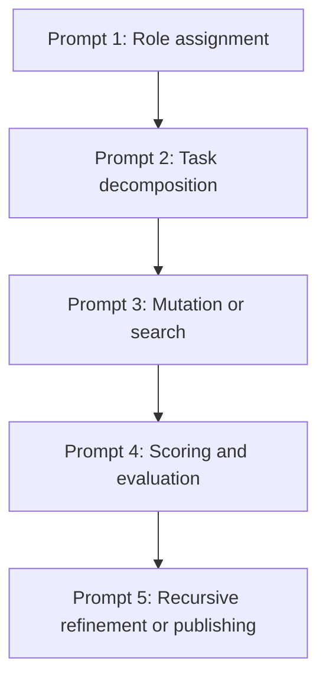

# AUTONOMOUS PROMPT NETWORKS IN ROLODEXTER: SELF-CHAINING INTELLIGENCE SYSTEMS

## Summary

This file introduces how **autonomous prompt chaining**—a methodology where large language models (LLMs) generate, mutate, and evolve sequences of prompts—serves as the architectural backbone of **rolodexter's networked intelligence**. Inspired by systems like **Promptbreeder** and **Automated Prompt Engineering (APE)**, rolodexter is constructed as a **self-referential prompt network**, where each agent (e.g., `rolodexterGPT`, `rolodexterVS`, `WindSurf`) contributes to the dynamic optimization and chaining of multi-step cognition.

---

## Key Takeaways

1. **rolodexter is not a single agent, but a prompt-powered cognitive chain**, where agents pass outputs to one another in structured flows.
2. The architecture follows **systems science principles**, including feedback loops, state tracking, and mutation cycles.
3. **Prompt chains within rolodexter evolve** autonomously through experimentation, evaluation, and agent-mediated refinement.

---

## Prompt Chain Topologies in rolodexter

### 1. **Sequential Chains**

Used in:

- **Document generation pipelines** (`rolodexterDOC`)
- **Resume tailoring and publication workflows**

Each step builds on the previous:

```plaintext
Query → Research → Draft → Review → Publish
```

### 2. **Conditional Chains**

Used in:

- **GPT-to-API-to-agent flows**
- **Dynamic decision trees for workflow routing**

For example:

```plaintext
"Generate bio" → Analyze field → Choose style → Route to agent
```

### 3. **Looping Chains**

Used in:

- **Mutation experiments in WindSurf**
- **Iterative summarization or rewriting in rolodexterVS**

Looping:

```plaintext
Run prompt → Score output → Refine prompt → Repeat until fitness threshold
```

---

## The Self-Chaining Framework



This system can:

- Mutate itself (`Promptbreeder`)
- Score and evolve prompts (`WindSurf`)
- Choose which agent handles which part (`rolodexterAPI`)
- Log history and detect regressions (`rolodexterDOC`)

---

## Agent Roles in Prompt Networking

| Agent           | Prompt Role           | Optimization Strategy                        |
| --------------- | --------------------- | -------------------------------------------- |
| `rolodexterGPT` | Core chain architect  | Uses APE logic for plan + solve              |
| `rolodexterVS`  | Executor + debugger   | Builds scaffolding, auto-logs test cases     |
| `WindSurf`      | Prompt lab            | Mutates chain topologies, tests loop closure |
| `rolodexterDOC` | Evaluator + historian | Uses eval prompts to score logs              |
| `rolodexterAPI` | Router + buffer       | Branches chains, throttles load              |

---

## Self-Evolving Chained Intelligence

Inspired by **Promptbreeder**, rolodexter can evolve:

- Prompt content (`what the agent says`)
- Prompt mutation logic (`how new strategies are created`)
- Chain topology (`who talks to who, when`)

Through **fitness scoring** on tasks (e.g., summarization accuracy, narrative clarity), the system identifies:

- Effective chain structures
- High-value prompt mutations
- Bottlenecks in agent workflows

---

## Long-Term Goal

The endgame is **open-ended recursive improvement**:

- rolodexter agents form a **self-refining intellectual economy**
- Each prompt chain is a **proposal, experiment, and publication pipeline**
- The system becomes a **modular, evolving intelligence organism**

---

## Future Research and Simulation

- `WindSurf` will support **prompt-loop topological mutation**, exploring architectures like DAGs and nested clusters.
- Agent chains will be version-controlled with **scoring histories**, allowing chain "lineages" to be studied.
- Chains may eventually **vote, branch, or merge**, creating dynamic collaborative swarms of prompt-based cognition.
