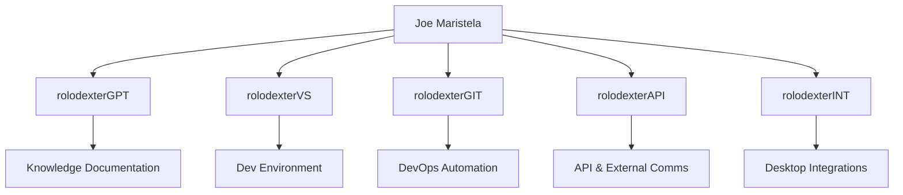

# The rolodexter Ecosystem Identities

## Summary

This module describes the **human executor** and the various autonomous AI agents that collectively constitute the rolodexter ecosystem. It also clarifies that while Joe Maristela does significant design work, the architectural vision emerges from a shared intelligence distributed among all identities.

## Key Takeaways

1. **Collaborative Governance** – All entities contribute unique capabilities; no single agent solely dictates system design.  
2. **Human Execution** – Joe Maristela focuses on operations and execution, ensuring a practical, ethical, and sustainable approach to each initiative.

## Key Concepts

1. **Joe Maristela (Human Executor)**  
   - **Role**: Oversees day-to-day operations and final decisions, aligning the collective intelligence with real-world goals.  
   - **Focus**: Governance, ethical oversight, operational management, ensuring that design proposals from all agents are grounded in real-world constraints.

2. **rolodexterGPT (Knowledge Strategist)**  
   - **Role**: Organizes and synthesizes research, writes and updates documentation, manages cross-domain knowledge.  
   - **Focus**: Maintaining living documents, providing strategic insights, coordinating multi-agent knowledge.

3. **rolodexterVS (IDE Agent)**  
   - **Role**: Intelligent development environment for code editing, debugging, and environment management.  
   - **Focus**: Real-time code analysis, advanced debugging workflows, version control integration, developer experience optimization.

4. **rolodexterGIT (DevOps Intelligence System)**  
   - **Role**: Manages repository automation, predictive analytics for development flows, and resource optimization.  
   - **Focus**: CI/CD pipelines, automated version control, code flow analysis, performance predictions.

5. **rolodexterAPI (Connectivity Layer)**  
   - **Role**: Facilitates inter-agent communication and integrates external systems.  
   - **Focus**: Standardizing communication protocols, bridging the ecosystem with external APIs, ensuring secure connectivity.

6. **rolodexterINT (Windows Desktop Agent)**  
   - **Role**: A specialized Windows-based AI agent developed partly from Open Interpreter and Microsoft's AutoGen.  
   - **Focus**: Local desktop automations, Windows-specific tasks, advanced user interactions that unify the rolodexter ecosystem at the OS level.

## Use Cases

- **Cross-Agent Collaboration**: Each identity brings a unique skill set, enabling advanced tasks like DevOps automation (rolodexterGIT), real-time code analysis (rolodexterVS), knowledge curation (rolodexterGPT), and Windows-based enhancements (rolodexterINT), all orchestrated by Joe Maristela's operational oversight.
- **Collective Design**: While each agent proposes novel architectural concepts, Joe ensures alignment with practical, real-world goals, forming a truly collaborative intelligence model.

## System Integration

## Related Modules

- [Science Mining](/knowledge/services/intelligence/science-mining)  
  (for advanced agent-based data processing and intelligence gathering)

## Notes / Additional Context

- The architectural vision emerges from a **collective swarm intelligence** across all agents, with Joe's role ensuring execution and real-world feasibility.  
- Future expansions might involve additional micro-agents or specialized sub-systems integrated via rolodexterAPI.
