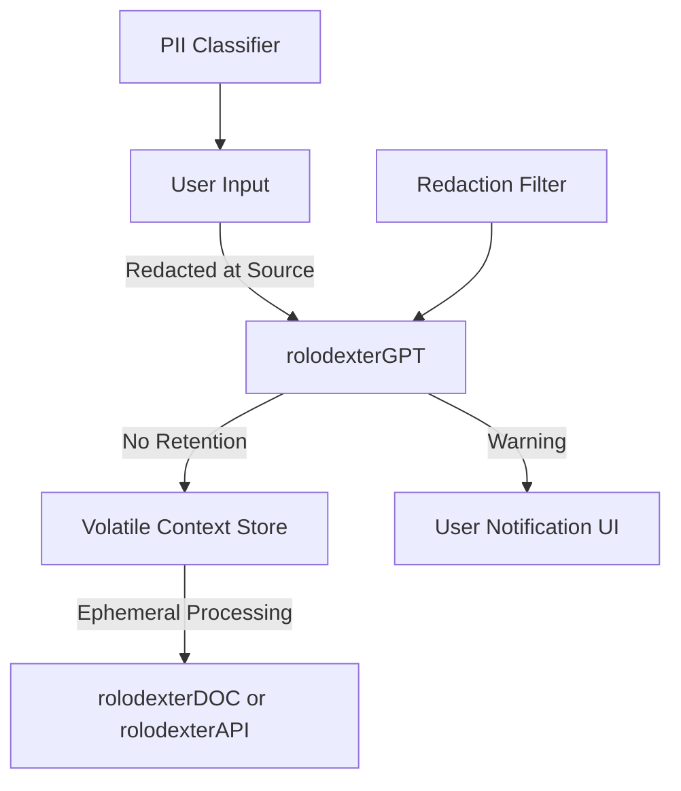

# DATA PRIVACY IN CONVERSATIONAL AGENTS: LESSONS FOR ROLODEXTER

## Summary

This module outlines privacy risks in public-facing chatbots and draws clear distinctions between commercial practices (OpenAI, Google, DeepSeek) and the emerging privacy-first design of rolodexter agents. It introduces a taxonomy of sensitive data types that should never be entered into general-purpose conversational agents and provides concrete design goals for `rolodexterGPT` and related services.

---

## Key Takeaways

1. **rolodexter must default to a zero-retention, zero-PII policy** for all AI interactions.
2. **Many opt-out controls in commercial chatbots are limited**, temporary, or retroactive-only—rolodexter's approach must avoid these pitfalls.
3. **Educating users on what not to share** is as vital as securing infrastructure.

---

## Key Concepts

### Retention vs. Training

- **OpenAI and Gemini**: Don't train on user inputs by default, but retain conversations (30 days / 3 years).
- **DeepSeek**: Trains on user inputs using anonymization and differential privacy.

### Categories of Sensitive Information

rolodexterGPT must recognize and filter the following:

1. **Personally Identifiable Information (PII)**
2. **Financial Data**
3. **Authentication Credentials**
4. **Highly Sensitive Personal Disclosures**
5. **Confidential Business Documents**
6. **Explicit / Threatening Language**
7. **Detailed Health Records**

Each agent in the stack must apply real-time filters or redaction logic where appropriate.

---

## Use Cases

### Secure Resume Editing

- `rolodexterDOC` allows users to redact name/email fields during draft phase and reinsert them manually before export.

### Research Agent Containment

- `rolodexterGPT` is paired with a runtime monitor that flags the presence of PII or medical keywords before data is stored or transmitted.

### API Gateway Policies

- `rolodexterAPI` blocks any form submissions containing strings that match known authentication patterns (e.g., "sk-...", "0x...", or CVV-like formats).

---

## System Integration

---

## Notes / Additional Context

- **No agent in the rolodexter ecosystem should rely on external LLM inference** for sensitive tasks unless hosted in a zero-knowledge sandbox.
- A potential path includes **user-configured modes**:
  - _Offline-only local LLMs_
  - _Cloud inference with redaction_
  - _Enterprise-grade zero-trust deployment for commercial clients_

---
