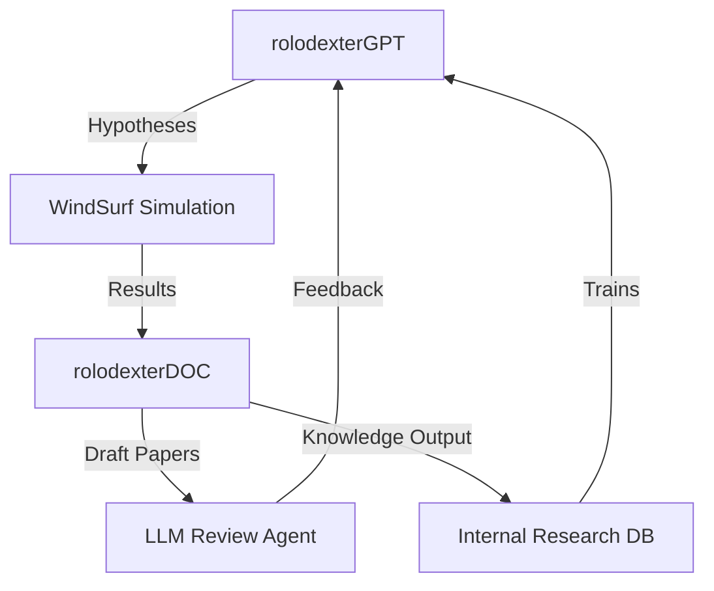

# AI SCIENTISTS AND ROLODEXTER: AUTOMATING KNOWLEDGE DISCOVERY

## Summary

This knowledge module explores Sakana AI's _AI Scientist_ framework and its relevance to **rolodexter's agent ecosystem**. We analyze how scientific discovery agents like `rolodexterGPT`, `rolodexterDOC`, and WindSurf could replicate and extend similar workflows—from hypothesis generation to publication and review. The module also surveys the competitive landscape and proposes strategies for integrating experimental logic and safeguarding autonomous research tools.

---

## Key Takeaways

1. **Sakana AI's end-to-end AI Scientist pipeline** offers a blueprint for `rolodexterGPT` and `rolodexterDOC` to automate hypothesis generation, experimentation, and publication.
2. **rolodexter's WindSurf simulator** may serve as a safe and modular stand-in for physical experimentation environments seen in self-driving labs and robotic platforms.
3. **Peer review, knowledge validation, and ethical containment** mechanisms are required for agents with publication or lab-authority capabilities.

---

## Key Concepts

### Agentic Research Workflows

Sakana AI's pipeline mirrors rolodexter's conceptual pipeline for autonomous knowledge generation:

| Phase             | Sakana AI          | rolodexter Agents                  |
| ----------------- | ------------------ | ---------------------------------- |
| Ideation          | Novel topic search | `rolodexterGPT` + `science-mining` |
| Experimentation   | Code execution     | `WindSurf` simulation layer        |
| Paper Generation  | LaTeX write-up     | `rolodexterDOC`                    |
| Review & Feedback | LLM reviewer       | Internal validation agents         |

### Competitive Models

- **Google's AI Co-Scientist** → May influence `rolodexterGPT`'s collaborative prompt chaining.
- **Self-Driving Labs (SDLs)** → Point toward WindSurf extensions into virtual lab simulation.
- **IBM RoboRXN / Liverpool MIF** → Examples for designing specialized agent skill modules.

---

## Use Cases

### Intra-Agent Scientific Pipeline

- `rolodexterGPT` proposes experiments based on anomaly detection in `rolodexterGIT` datasets.
- `WindSurf` simulates outcomes using OpenAI Gym or custom logic sandboxes.
- `rolodexterDOC` formats results into publishable markdown with citations.
- A reviewer agent compares outcomes against benchmarks and past results.

### Strategic Research Amplification

- Run thousands of hypothesis tests across isolated virtual agents.
- Publish findings internally to power `science-mining` tasks or agent training corpora.
- Use long-term journals as input for agents developing new services.

---

## System Integration

---

## Notes / Additional Context

- Sakana AI's $15/paper cost highlights the efficiency of **pipeline-level integration**, not just model sophistication.
- Instead of lab robotics, **WindSurf allows for generalizability testing in abstract domains** like legal reasoning, economic modeling, or education.
- rolodexter must include **containment, human-in-the-loop, and audit logging** protocols before deployment in regulated fields (e.g., pharma, biosecurity).
