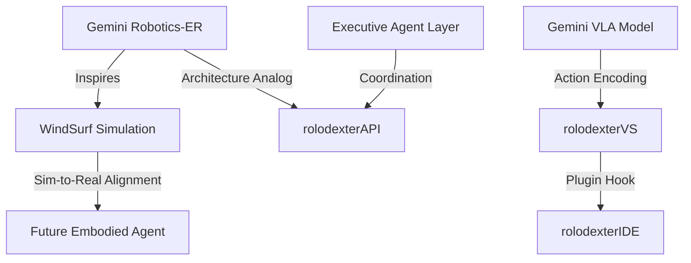

# EMBODIED AI AND GEMINI ROBOTICS: IMPLICATIONS FOR ROLODEXTER

## Summary

This module connects the embodied AI breakthroughs in Google's Gemini Robotics platform to the vision and direction of the rolodexter agent ecosystem. It explores how Gemini Robotics' vision-language-action (VLA) capabilities—especially generalization, reasoning, and zero-shot physical control—can inspire enhancements to `rolodexterGPT`, `rolodexterVS`, and future embodied agent integrations like WindSurf.

## Key Takeaways

1. **Gemini Robotics introduces general-purpose embodied agents** with fine-motor dexterity and reasoning grounded in real-world physics.
2. **rolodexter may evolve to support hardware-based agents** for embodied research, drawing from Gemini's zero-shot and few-shot task handling.
3. **WindSurf**, the multi-agent simulator within the rolodexter stack, is well positioned to prototype physical analogs before hardware execution.

---

## Key Concepts

### Embodied Reasoning (Gemini-ER)

- Gemini's foundational model for **2D/3D object detection**, **trajectory prediction**, and **multi-view correspondence** mirrors the goals of `rolodexterAPI` in simulation orchestration.
- Could inform **spatially-aware prompt chaining** in `rolodexterGPT` for agent coordination tasks in both physical and simulated environments.

### Vision-Language-Action (Gemini Robotics)

- Adds **physical action execution** to LLMs.
- Suggests a path forward for **interface protocols** in `rolodexterVS` to potentially control agent proxies or virtual limbs in WindSurf.

### Zero-Shot Control

- Gemini Robotics-ER can generate robot code **without being trained on robot action data**, an approach analogous to `rolodexterGPT`'s agent-to-agent script synthesis for new modules.

---

## Use Cases

### Simulation-to-Hardware Transfer

- Gemini's origami and salad-packing examples align with **WindSurf's eventual goal** of training AI agents in virtual settings before deployment in real-world robotic scenarios.

### Agent Extensions to Physical Interfaces

- In the rolodexter roadmap, **agent-controlled physical surfaces** (e.g., voice assistants, IoT arms) could eventually mirror Gemini's "robots as just another surface for AI."

### Research Integration

- Gemini-style embodied benchmarks could feed into `rolodexterGPT`'s research workflows—especially around planning, prediction, and feedback chaining.

---

## System Integration

---

## Notes / Additional Context

- Gemini's success reinforces rolodexter's **multi-agent orchestration hypothesis**: that agents can generalize across unfamiliar modalities with appropriate coordination logic.
- Incorporating **physical agent simulations** in WindSurf could enable prototyping AI-assisted surgeries, assembly lines, or VR-avatar systems.
- Ethical risks raised by Gemini—AI moving from language-only to **actuator-enabled**—mirror rolodexter's internal guidelines for safe simulation, logging, and reversible action layers.
