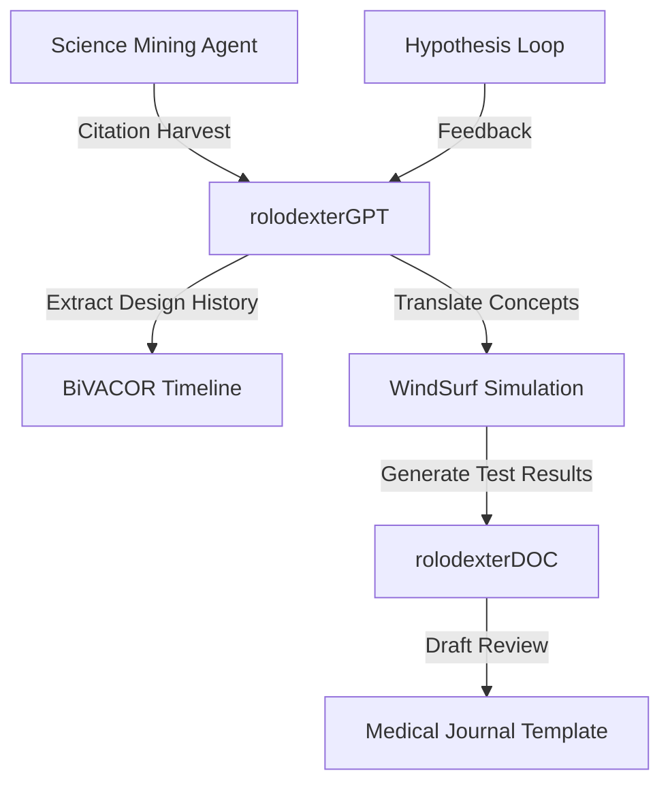

# TITANIUM HEARTS AND ROLODEXTER: MINING SCIENCE FROM ENGINEERING BREAKTHROUGHS

## Summary

This module interprets the development of the **BiVACOR titanium artificial heart** through the lens of **agent-assisted scientific mining and design** within the rolodexter ecosystem. It outlines how agents like `rolodexterGPT`, `rolodexterDOC`, and WindSurf can replicate the iterative design, literature mapping, and hypothesis generation cycle behind this engineering milestone—creating a scalable template for cross-domain discovery.

---

## Key Takeaways

1. **rolodexter can mine citation chains, designs, and failure modes** from landmark biomedical devices like BiVACOR.
2. **Agentic simulation in WindSurf** could be used to model fluid dynamics, magnetic levitation systems, or failure tolerances in continuous-flow devices.
3. **Systems design principles from titanium heart development**—such as radical simplification—can inform agent-generated hypotheses across other engineering disciplines.

---

## Key Concepts

### Systems-Driven Science Mining

- The BiVACOR heart shows how plumbing concepts (rotary motion, magnetic suspension) translate into high-impact biomedical design.
- rolodexter's `science-mining` module can identify similar analogies in published literature or simulation archives.

### Single-Moving-Part Design Principle

- Simplification of complex biological functions into continuous rotary dynamics offers an opportunity for **agent-proposed alternative models** in organ replication, robotics, or smart prosthetics.

### Cross-Domain Engineering Reasoning

- rolodexter agents can help explore **crossovers between transportation (maglev trains)** and **biomedical devices**, echoing BiVACOR's own design lineage.

---

## Use Cases

### Reverse-Engineering Literature

- `rolodexterGPT` parses transcripts and scientific commentary (e.g., YouTube explainers, papers).
- It then outputs **structured timelines, parts lists, citation trees**, and critical thresholds (RPM, blood volume, material tolerances).

### Agent-Proposed Redesign Experiments

- WindSurf can model **power-to-blood-volume ratios**, battery depletion profiles, or magnetic bearing endurance.
- `rolodexterDOC` generates annotated engineering reports for grant applications or peer-reviewed publishing drafts.

### Biomedical Forecasting Agent

- Using data from continuous-flow experiments, agents can propose **next-gen prosthetics** or **non-blood-based pumping systems** (e.g., for dialysis or cerebrospinal fluid support).

---

## System Integration

---

## Notes / Additional Context

- rolodexter may eventually support **real-time ingest of hardware demo videos** and sync with scientific output pipelines like preprint repositories.
- **Agentic mining of failure reports**, patent filings, and surgical case notes is a major next step in rolodexter's expansion into healthtech and biomedical R&D.

---
