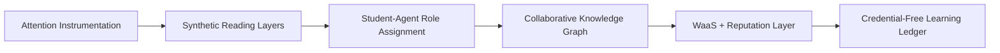

Today's college student appears disengaged, overwhelmed, and often functionally illiterate in traditional academic contexts. But what if these observations are not failures of will—but signals of a **misaligned system**? In this article, we use systems science to reframe declining academic engagement not as generational decay, but as an emergent property of socio-technical feedback loops. We propose a new experimental methodology powered by **rolodexterLABS infrastructure**, deploying agentic simulations, behavioral instrumentation, and adaptive educational meshes to rewire the learning environment for 21st-century cognition.

---

## 1. FROM DECLINE TO DESIGN: SHIFTING THE NARRATIVE

A viral article recently claimed that "most of our students are functionally illiterate" and "see reading as punishment" . But blaming students obscures the deeper reality:

> The education system is not failing; it’s **optimized for the wrong parameters**.

At **rolodexterLABS**, we believe learning is a dynamic system:

- Influenced by interfaces, incentives, neuroplasticity, and economic stress
    
- Governed by feedback loops more than intentions
    
- Recoverable through **adaptive protocol architectures**, not punishment
    

---

## 2. SYSTEM VARIABLES UNDER SCRUTINY

|System Variable|Example Symptoms|LABS Tools|
|---|---|---|
|**Literacy Collapse**|Skimming without comprehension|`Synthetic Discovery` for reading pattern mutation|
|**Attention Fracture**|Phone addiction, passive classroom behavior|`Observation Framework` via `WaaS telemetry`|
|**Credential Transactionalism**|Learning optimized for GPA, not growth|`Worker Design` for knowledge-based incentives|
|**Institutional Drift**|Static teaching models vs dynamic learners|`Protocol Services` for pedagogy redesign|

---

## 3. EXPERIMENTAL ARCHITECTURE FOR ACADEMIC ANALYSIS

We propose a multi-layer experimental pipeline using LABS services:

### 🎯 _Functional Literacy Simulator_

- Students read multiple genres: Pulitzer fiction, TikTok comments, scientific abstracts
    
- `rolodexterMemory` tracks comprehension scores, re-read patterns, semantic chunking
    
- `Model Services` evolve prompt scaffolds that can re-teach difficult passages
    

---

### 🧠 _Attention Mesh Instrumentation_

- Use webcam, posture, clickstream, and biometric logs to detect:
    
    - Engagement collapse
        
    - Recovery points
        
    - Lecture modality effectiveness
        
- Encoded via `Worker Design` → `Observation Swarms` → `Metascience QA`
    

---

### 🧪 _Credentialism Experiment_

- Two course cohorts:
    
    1. Credential-framed (GPA, job-skill badges)
        
    2. Mastery-framed (peer-explained concepts, concept networks)
        
- `Synthetic Discovery` agents compare concept retention 4 weeks later
    

---

### 🧬 _Agentic Student Models_

- Simulate time-constrained students across 4 course loads
    
- Vary:
    
    - Economic pressure
        
    - Work hours
        
    - Class formats
        
- Measured using `Protocol Simulation Engines`
    

---

## 4. LABS SERVICE STACK FOR COGNITIVE SYSTEM REDESIGN

|Service|Role in Educational Systems|
|---|---|
|`Synthetic Discovery`|Simulate future learner trajectories under different attention models|
|`Model Services`|Embed AI tutors, reading explainers, and dynamic problem reframers|
|`Worker Design`|Let students become mini-agents in knowledge ecosystems|
|`WaaS`|Convert knowledge tasks into tokenized modules, incentivized by learning not grades|
|`Metascience`|Audit learning interventions for epistemic validity and reproducibility|
|`Protocols`|Deploy adaptive pedagogical frameworks based on feedback loops|

---

## 5. REFRAMING HYPOTHESES FOR SYSTEM TESTING

### 📱 _Technological Adaptation Hypothesis_

> Students didn’t “lose attention.” Their attention **evolved** for different information geometries.

**LABS Test**:  
Compare comprehension in TikTok story threads vs classical essays using `Synthetic Discovery`  
Evolve reading prompts that increase classical retention by mutation

---

### 🏫 _Institutional Misalignment Hypothesis_

> Education systems remained static while learners evolved rapidly

**LABS Test**:  
Deploy `Protocol Variants` across cohorts

- Traditional lecture
    
- Chat-based agents
    
- Peer-led Socratic chains  
    Compare attendance, engagement, and final synthesis essays
    

---

### 💼 _Economic Optimization Hypothesis_

> Students respond rationally to incentive structures they didn’t create

**LABS Test**:  
Introduce alternate incentive loops:

- Knowledge-to-credit micro-certificates
    
- Concept mastery bounties
    
- Agent-generated weekly audits
    

Measure outcomes with `WaaS telemetry` + `Observation Meshes`

---

## 6. THE NEW STUDENT OS: A DESIGN PROPOSAL

> Education isn’t failing. It’s **awaiting a system upgrade.**

**rolodexterLABS proposes** a modular learning OS:

This system turns the disengaged student into:

- A **knowledge worker**
    
- A **systems participant**
    
- A **peer-coordinator in a dynamic mesh**
    

---

## 7. CONCLUSION: FROM ANECDOTES TO AGENTS

Educators may feel despair at declining student literacy and motivation. But rolodexterLABS sees an opportunity:

> The system is revealing itself. It is ready for debugging.

Through a combination of:

- Simulated educational futures
    
- Modular protocol redesign
    
- Memory-compatible learning trails
    
- Self-adaptive reading agents
    

We can build **an educational intelligence layer** optimized for the present—and ready for what comes next.

