As demand rises for scientific LLMs capable of solving high-stakes problems, a troubling reality persists: even state-of-the-art models struggle with multi-step reasoning, physics comprehension, and mathematical computation. This article evaluates the limitations of contemporary models through a systems science lens and proposes **rolodexterLABS infrastructure** as a modular path forward. By introducing agentic refinement frameworks, meta-prompt mutation, and symbolic compute integration into scientific LLM workflows, rolodexterLABS enables scalable, verifiable, and reproducible AI reasoning across advanced domains.

---

## 1. THE FAILURE OF PURE TOKEN PREDICTION

Language models excel at pattern continuation—but physics is **not just a pattern**. It’s a formal system of interdependent abstractions that require:

- **Precision over fluency**
    
- **Sequential logic over parallel synthesis**
    
- **Failure tracing and recursive correction**
    

Current models, even those fine-tuned on domain-specific corpora, often collapse under the weight of **symbolic constraints and contextual nuance**.

---

## 2. FAILURE MODES: A SYSTEMS DIAGRAM

This **compounding error cascade** is especially dangerous in scientific workflows, where stepwise accuracy is mandatory. **rolodexterLABS services** are designed to interrupt this cascade through agent-based interventions and multi-pass evaluation protocols.

---

## 3. SYSTEMIC BARRIERS TO SCIENTIFIC LLM DEPLOYMENT

|Challenge|Description|rolodexterLABS Response|
|---|---|---|
|❌ Conceptual misalignment|Misidentifies governing laws or units|`Model Services` inject semantic scaffolds and physics templates|
|❌ Computational breakdowns|Arithmetic, algebraic, or symbolic failures|`Code-Driven Refinement` with external compute agents|
|❌ Contextual detachment|Fails to apply theory to physical context|`Worker Design` embeds context validation agents|
|❌ Accumulated error propagation|Small mistakes magnify downstream|`MoRA-style agent loops` for error tracing and rollback|
|❌ Symbolic rigidity|Poor handling of abstract proofs|`Synthetic Discovery` creates mutated concept variants for reasoning expansion|

---

## 4. LABS MODULES FOR SCIENTIFIC LLM ARCHITECTURE

### 🔁 `Model Services`: Error-Aware Reasoning Chains

- Encodes physics principles as modular prompt-chains
    
- Integrates multi-agent checkpoints to validate steps
    
- Supports nested computation logs with confidence tags
    

---

### ⚙️ `Worker Design`: Agents With Embedded Units and Constraints

Each worker:

- Has role-specific equation libraries
    
- Performs dimensional analysis checks
    
- Invokes code-refinement loops if inconsistencies arise
    

---

### 🧠 `Synthetic Discovery`: Prompt Evolution for Scientific Tasks

Inspired by Promptbreeder and MoRA:

- Generates alternative prompt phrasings
    
- Mutates symbolic pathways
    
- Tests for conceptual degeneracy or error resilience
    

---

### 📐 `Metascience`: Performance Auditing + Experimental Ground Truth

- Tracks reasoning fallibility across model versions
    
- Stores human-corrected outputs as canonical references
    
- Enables reproducibility benchmarking for LLM workflows
    

---

## 5. EVIDENCE FROM BENCHMARK ANALYSIS

### 📊 GPT-4o vs Open-Source

|Task|GPT-4o|Llama-3-70B|Gemma-2-27B|
|---|---|---|---|
|PhysicsQA Accuracy|~89%|~71%|~68%|
|Conceptual Errors|Low|High|High|
|Computational Errors|Moderate|High|High|

LABS can host these benchmarks as real-time eval environments:

- Upload dataset → Assign agents → Trigger refinement → Score improvement
    

---

### 🧪 Llemma: Reasoning ≠ Memorization

The **Llemma model** outperforms baselines on novel problems **without overfitting to its training data**—suggesting:

- Symbolic pretraining yields generalization
    
- Reinforcement from scientific data improves abstraction handling
    

rolodexterLABS supports:

- Llemma-style training pipelines via `Model Development`
    
- Inference benchmarking across test suites via `Knowledge.md` + `Protocols.md`
    

---

## 6. CODE-DRIVEN REFINEMENT ARCHITECTURE (CDRA)

```mermaid
flowchart TD
  A[Prompt → Response]
  B[Error Detector Agent]
  C[Refinement Loop Agent]
  D[Symbolic Compute Agent]
  E[Validated Solution]

  A --> B --> C --> D --> E
```

With 73% refinement success rate on PhysicsQA (per [2]), CDRA can be implemented in LABS as:

- Autonomous module in `Model Services`
    
- With scoring metrics defined in `Metascience`
    
- Deployed via `Worker Swarms` for ensemble verification
    

---

## 7. SCIENTIFIC AGENTS IN PRACTICE

### 🔬 Example: Thermodynamics Research Assistant

1. `Input`: Derive entropy change from state function
    
2. `Agents`:
    
    - Concept validator: Confirms system constraints
        
    - Equation matcher: Picks canonical identity
        
    - Unit checker: Applies dimensional consistency
        
    - Code executor: Validates via symbolic compute
        
3. `Output`: Agent-corrected LaTeX derivation + verification graph
    

---

## 8. CONCLUSION: COMPUTATION IS NOT ENOUGH. COMPREHENSION MUST FOLLOW.

The modern scientific LLM cannot be a black box. It must be:

- Auditable
    
- Reflexive
    
- Multi-modal
    
- Symbolically grounded
    

With **rolodexterLABS**, we move toward this future by:

- Wrapping LLMs in agentic refinement shells
    
- Using `Synthetic Discovery` to mutate reasoning paths
    
- Validating outcomes with protocol-anchored reproducibility standards
    
- Creating worker ecosystems with roles, context, and accountability

