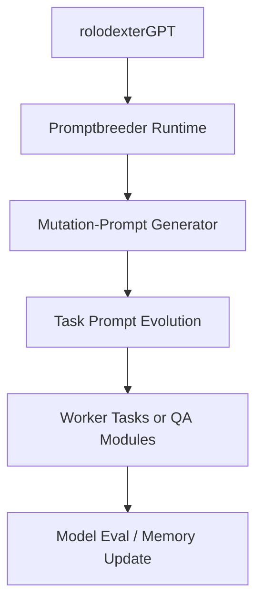

Promptbreeder marks a radical advancement in prompt engineering, shifting from one-level optimization to self-referential mutation systems that recursively refine their own evolution logic. In contrast to fixed evolutionary algorithms like EvoPrompt, Promptbreeder generates not just better prompts—but **better prompt generators**. This article places Promptbreeder within the infrastructure and research pipeline of **rolodexterLABS**, revealing how self-improving agents, meta-optimization loops, and intelligent mutation architectures align with our broader vision for synthetic cognition, model services, and composable AI ecosystems.

---

## 1. THE PROMPT IS NOT ENOUGH — THE MUTATOR IS THE MODEL

Most evolutionary algorithms (EAs) treat prompts as endpoints to be optimized. Promptbreeder reframes the equation:

> **Prompt = Output, but Mutation-Prompt = Meta-Strategy.**

This reorientation aligns precisely with rolodexterLABS’ commitment to:

- Multi-agent cognitive architectures
    
- Self-building intelligence systems
    
- Modular, verifiable model evolution
    

Promptbreeder’s architecture evolves both:

1. **Task-specific prompts**
    
2. **The logic for mutating and selecting those prompts**
    

This recursive loop mirrors our Synthetic Discovery and Model Development pipelines.

---

## 2. SYSTEM COMPARISON: PROMPTBREEDER VS LEGACY EA SYSTEMS

|Dimension|Promptbreeder|EvoPrompt / Legacy EA|rolodexterLABS Equivalence|
|---|---|---|---|
|**Optimization Layer**|Meta-optimization of mutation mechanisms|One-level prompt evolution|`Synthetic Discovery` + `Metascience QA`|
|**Mutation Strategy**|Self-evolving mutation-prompts|Fixed genetic operators|`Worker Design` + agent chain control|
|**Initialization**|Starts from single problem|Needs diverse population|`rolodexterIDE` seed scaffolding|
|**Computational Efficiency**|60% fewer evaluations|Larger populations|Efficient through `WaaS` + memory reuse|
|**Agentic Interpretability**|Mutation logic as prompts|Black-box operators|Fully explainable agent memory stack|

---

## 3. INTEGRATION INTO roLODExTERLABS SYSTEMS

### 🧠 **Model Development Services**

Promptbreeder’s evolved prompts are treated as **modular model augmentations**, versioned and verified in our `Model Services` suite:

- Integrated as prompt layers into live models
    
- Stored with lineage and fitness metadata
    
- Evaluated for hallucination, reasoning chains, and epistemic variance
    

### 🔁 **Synthetic Discovery Loops**

Promptbreeder enables recursive self-improvement—ideal for use in `Synthetic Discovery`:

- Agents evolve their own mutation rules for conceptual exploration
    
- Philosophical or scientific questions seeded as prompt roots
    
- Recursive evolution of ontologies, research heuristics, or system taxonomies
    

### 🧪 **Metascientific QA Loops**

Instead of hand-crafting prompts for reproducibility checks, metascientific agents can:

- Generate QA prompts via Promptbreeder logic
    
- Mutate those prompts to detect edge-case failures
    
- Score prompt performance on epistemic criteria
    

---

## 4. PROMPTBREEDER AS AN INFRASTRUCTURE MODULE

We treat Promptbreeder not as a standalone experiment, but as a **pluggable service** across LABS systems:

### Modular Uses:

- 🎯 Generate prompts for grant writing, agent workflows, code tasks
    
- 🧬 Re-optimize mutation logic for changing model behaviors
    
- 💡 Discover latent knowledge via recursive domain mutation
    

Promptbreeder chains can be launched, forked, or governed as **Work-as-a-Service payloads**, routed via `rolodexterAPI` and executed in `rolodexterVS`.

---

## 5. DESIGNING SELF-CORRECTING AGENTS

Promptbreeder isn't just about better prompts. It's about **emergent adaptability**. That makes it a core component of rolodexterLABS’s mission to:

- Build agents that can audit and improve their own reasoning
    
- Enable trust layers where mutation strategies are transparent and auditable
    
- Fuse data-driven evolution with symbolic instruction design
    

By encoding mutation logic as prompts, we gain **language-native evolution strategies**—enabling interpretability, modifiability, and agent-to-agent transfer.

---

## 6. FUTURE: TOWARD AN ECOSYSTEM OF SELF-EVOLVING MODELS

Promptbreeder’s architecture unlocks the following trajectories inside rolodexterLABS:

|Path|Description|
|---|---|
|**Prompt Lineage Graphs**|Traceable prompt-mutation chains, useful for reproducibility and governance|
|**Meta-QA Swarms**|Agent groups that evolve QA prompts for prompt audit layers|
|**Mutation Strategy Marketplaces**|Token-incentivized mutation strategies competing across open model systems|
|**Cross-Domain Prompt Transfer**|Evolve a prompt in biology; translate its strategy to governance or finance|

---

## CONCLUSION:

Promptbreeder reveals a future in which models don’t just learn—they **learn how to evolve themselves**.

At rolodexterLABS, we are building the systems that allow:

- Mutation strategies to be stored, shared, and monetized
    
- Prompt evolution to be reproducible and trust-preserving
    
- Model intelligence to become **reflexive, interpretable, and self-correcting**
    

This is not prompt engineering.  
This is **prompt evolution as infrastructure**.

